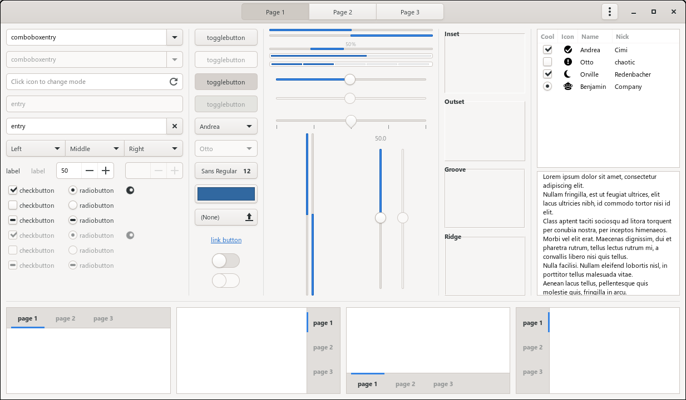

# NOTE: This pkgbuild will be discontinued (anyone can bring it to AUR/fork this repo for future maintenance) and will be replaced with new project called AdwaitaExtended. More info coming

=====

# gtk3-adwaita-compact-pkgbuild
Gtk3 patched to enable compact version of Adwaita theme. Currently only served as Arch Linux PKGBUILD

## Differences with original
There are no differences. But some widgets like headerbar, button, etc. paddings are reduced by changing `$_sizevariant` variable in `_common.scss` to `compact` 

### But why you don't make a separate Gtk3 theme instead?
It was intended to retain compatibility with GNOME applications. It's possible to make it as separate theme, but 'styling' that requires Adwaita stylesheet in these apps needs to re-implemented with additional scss added. Also, Adwaita forks with reduced widget paddings was aleady exist (ex: AdMin and Minwaita)

### Screenshots

### Instructions:
- Clone this repo
- Change directory `cd gtk3-adwaita-compact-pkgbuild`
- Run `makepkg -i`

### Credits
PKGBUILDs are based on [gtk3-typeahead](https://aur.archlinux.org/packages/gtk3-typeahead/) by twilinx

